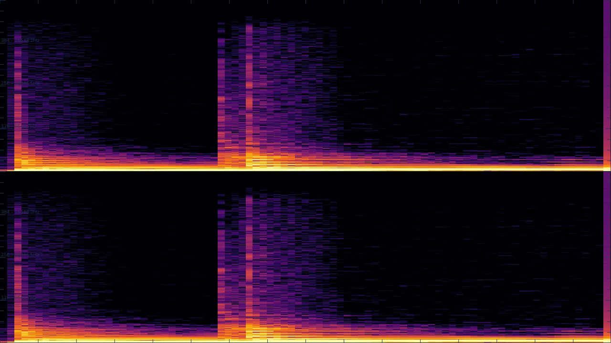

## Examples

### Image Example:

The example [export_image_and_display.py](export_image_and_display.py) exports the data as an image and displays with the [Pillow](https://github.com/python-pillow/Pillow) library. 
Install Pillow and run the example:

```sh
python3 -m pip install --upgrade Pillow
python3 examples/export_image_and_display.py
```
#### Output:



### CSV Example:

The example [export_CSV_and_print.py](export_CSV_and_print.py) exports the data as a CSV file and prints it in the console:

```sh
python3 examples/export_CSV_and_print.py
```
#### Output:
```
['TIME', 'DURATION', 'VALUE']
['0.0000000000', '0.0000000000', '-0.000031']
['0.0000226757', '0.0000000000', '0.000000']
['0.0000453515', '0.0000000000', '0.000000']
...
```

### Multiple Types Example:

The example [export_multiple_types.py](export_multiple_types.py) exports the data as JPEG, CSV and JSON files to the **examples/exports/multiple** folder.

```sh
python3 examples/export_multiple_types.py
```

### Document Basic Creation Example:

The example [document_basic_creation.py](document_basic_creation.py) shows how to create a document containing a group containing itself a track and save it to the **examples/templates/example.xml** file.

```sh
python3 examples/document_basic_creation.py
```

### Document Loading Example:

The example [document_load.py](document_load.py) shows how to load a document from an existing template (.ptldoc file), edit the name of the first group and save the result to the **examples/templates/factory.ptldoc** file.

```sh
python3 examples/document_load.py
```

### Document using Track with Plugin Example:

The example [document_track_with_plugin.py](document_track_with_plugin.py) shows how to use the get_plugin_list() method to create a PluginList object containg all the avalaible plugins and how to print it. It also shows how to set a plugin_key to a track. The result is saved to the **examples/templates/example.ptldoc** file.

```sh
python3 examples/document_track_with_plugin.py
```
#### Output:
```
...
partiels-vamp-plugins:partielsnewtrack, markers
partiels-vamp-plugins:partielsnewtrack, points
partiels-vamp-plugins:partielsspectrogram, energies
partiels-vamp-plugins:partielswaveform, peaks
...
```

### Document using Track with File Example:

The example [document_track_with_file.py](document_track_with_file.py) shows how to set a file to a track. The result is exported to the **examples/exports/document_track_with_file** folder.

```sh
python3 examples/document_track_with_file.py
```
